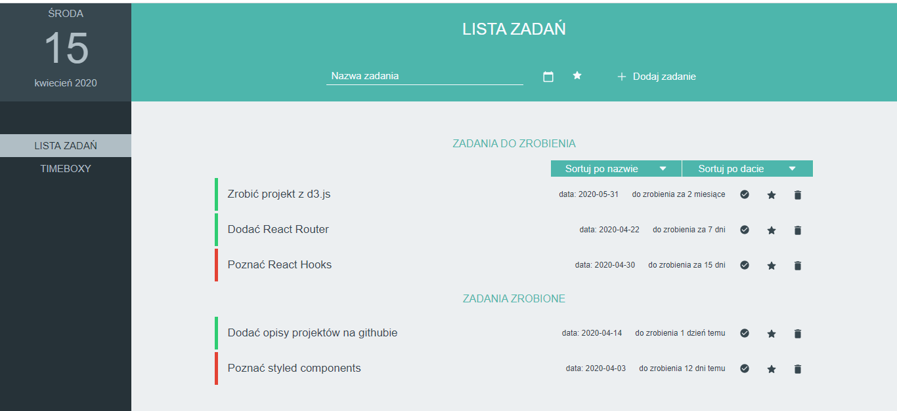
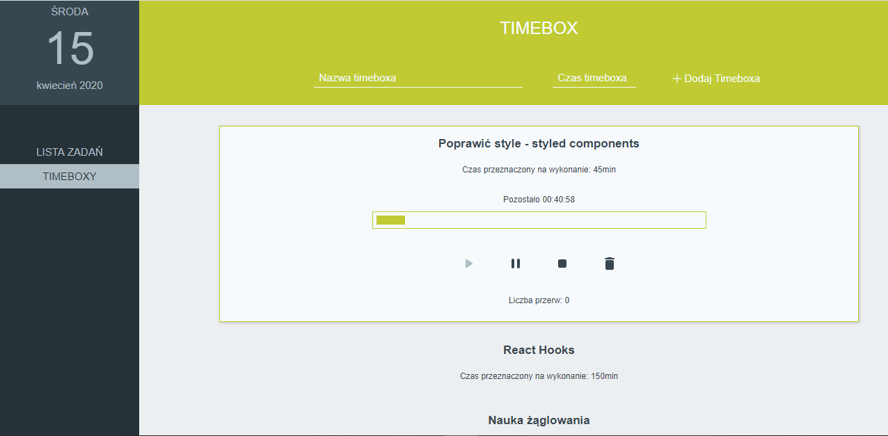

# Personal Organizer

> Personal organizer app is made as your time manager.
It's made in React with styled components and moment.js libraries.

## General info

For now app has two funcionalities:
 - ##### ``  Timebox`` 
    based on time management method known as [Pomodoro Technique](https://en.wikipedia.org/wiki/Pomodoro_Technique)
    - Decide what you want to do and add name of the timebox.
    - Decide how much time you want to spent with your activity. Set the timer and create timebox.
    - When you are ready play your timebox and start working.
    - You should be focused only on your activity, and originally it shouldn't be longer than 25 minutes.
    - You can set many timeboxes and play them regulary.

 - ##### ``  Lista zadań``
     is made as a day planner.
    - Decide what you want to do put the name.
    - When you want to finish your task? Set the date.
    - Is it important? You can choose and set the star.
    - Add your task.
    - When you have more tasks you can sort them (by name and by date) and change importance.
    - When you finish your tasks, set them as finished or delete them.

## Screenshots
#### LISTA ZADAŃ page

#### TIMEBOX page

###### `: : :   this app is still in progress : : :`
#
##### What I want to add?
- save the data on server
- add Calendar page
- add React router

## Styling

This project uses [styled-components](https://styled-components.com/) to handle styling: `src/theme/theme.js` defines the styling base and `src/theme/GlobalStyles.js` includes basic element styles along with the CSS Reset.

## Dependencies
##### Technology
- `react`: version 16.12.0
- `moment`: version 2.24.0
- `react-uuid`: version 1.0.2
- `styled-components`: version 5.0.1

##### Icons
- Icons from [``Ionicons.com``](https://ionicons.com/)

## Installation

- Clone the repo in your terminal by clicking the _green_ clone or download button at the top right and copyin the url
- In your terminal, type `git clone URL`
  - replace URL with the url you copied
  - hit enter
- This will copy all the files from this repo down to your computer
- In your terminal, cd into the directory you just created
- Type `npm install` to install all dependencies
- Last, but not least, type `npm start` to run the app locally.
- To look at the code, just open up the project in your favorite code editor!a

